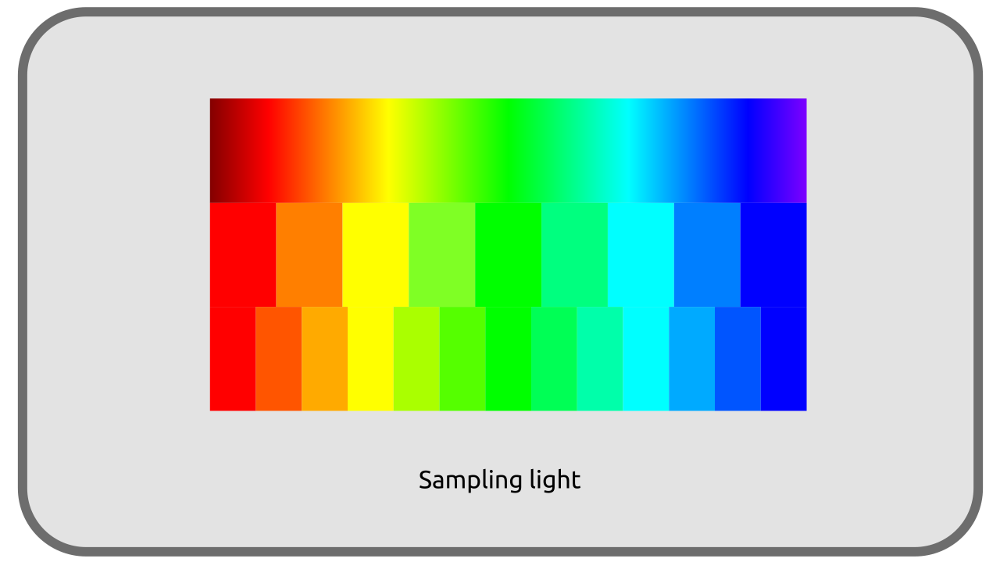

# D - Du réel au numérique

Ayant maintenant un moyen de représenter objectivement les couleurs que nous voyons, de les localiser sur un diagramme de référence, nous pouvons nous poser la question de la manière à la fois de numériser, de stocker, puis de restituer ces couleurs via un système binaire.

[TOC]

## D.1 - Numérisation et stockage : passer en binaire

Toute la difficulté est de représenter un monde analogique et *continu*[^1] dans un système fondamentalement *discontinu* et numérique, avec des [*valeurs discrètes*](https://fr.wikipedia.org/wiki/Math%C3%A9matiques_discr%C3%A8tes).



En numérique binaire, toute valeur, qu'elle soit un nombre ou une couleur, doit être stockée en une suite de zéros et de uns, ce qu'on appelle des ***bits***[^2]. Il est donc impossible de représenter l'ensemble des nombres réels en numérique, et nous devons *quantifier*, découper l'infinité de couleurs que nous pouvons voir en un **nombre fini** de valeurs numériques. C'est *l'échantillonnage* (*sampling* en anglais).

Plus nous découpons ces valeurs en petits quanta, en petits échantillons, en petites briques, plus nous gagnons en précision et plus nous pouvons approcher une représentation fidèle du réel ; mais se pose alors la question du stockage et de la place nécessaire.

Faisons un calcul simple : prenons une image numérique divisée en une "grille" de 1920 pixels en largeur et 1080 pixels en hauteur, la résolution d'une vidéo numérique standard (en 2020). Cette image contient donc `1920 x 1080 = 2 073 600 pixels`.

Dans sa forme la plus courante, un pixel est représenté par trois valeurs d'intensité pour trois couleurs primaires. Chacune de ces trois valeurs est généralement stockée dans *au minimum* 8 bits. Chaque pixel a donc besoin de `3 x 8 = 24 bits` ou encore `3 octets` pour être stocké (un octet étant formé de 8 bits). Notons que ce choix d'utiliser un octet (8bits) par couleur primaire permet "seulement" 256 valeurs par primaire (`2^8`) soit un total d'environ 65 millions (`256^3`) de nuances de couleurs différentes. Cela peut sembler beaucoup, mais c'est encore loin des nuances que perçoit l'œil humain.

Notre image a donc besoin de `2 073 600 pixels x 3 octets = 6 220 800 octets` pour être stockée. 6 Mo pour une seule image, ce qui signifie *au minimum* `6 x 24 = 144 Mo` pour une seconde de vidéo, ou encore `144 x 60 = 8 640 Mo` pour une minute, plus de **8 Go**[^3] !

```
1920 px x 1080 px x 3 primaires x 8 bits x 24 ips x 60 s ≈ 64 Gbps ≈ 8 Go/s
```

Cette taille représente un débit de données de 64 Gbps.À titre d'exemple, un film sur un disque Blu-Ray est encodé avec un débit de 24 Gbps environ, ce qui signifie qu'il faut diviser cette taille par au moins 2,6...

## D.2 - Les Espaces colorimétriques

Il faut donc trouver des méthodes permettant de réduire la place occupée par toute cette information ; c'est là qu'entrent en jeu les différents choix d'espaces colorimétriques et méthodes de *compression* et d'*échantillonage* des données associés.

Ce problème est d'ailleurs apparu bien avant l'avènement du numérique : les flux de données analogiques, via des signaux électriques, ont eux aussi une capacité de transfert (une bande passante) limitée, et même bien plus limitée que la transmission d'information numérique utilisant les mêmes câbles de cuivre, ce qui explique les limitations de format imposées aux premières heures de la vidéo, sans compter les problématiques de stockage.

La manière de stocker les informations lumineuses échantillonnées (numérisées) varie donc en fonction du matériel utilisé pour la captation (la caméra) ou la génération (en synthèse), ainsi que de l'usage que l'on compte en faire, et influence la quantité de données à stocker.

**Le choix de la façon de stocker les données va aussi définir quelles données seront perdues**, puisqu'il est impossible de rester fidèle au réel, ou encore **quels types de lumières et de données seront privilégiées** (l'intensité ou la teinte, la pénombre ou les hautes lumières...).

Le système de stockage des données de lumière est ce que l'on appelle l'**espace colorimétrique**.

----
Sources et références

- [Mathématiques discrètes sur *Wikipedia*](https://fr.wikipedia.org/wiki/Math%C3%A9matiques_discr%C3%A8tes)


[^1]:
    Avec l'avènement de la [physique quantique](https://fr.wikipedia.org/wiki/Physique_quantique), nous savons aujourd'hui que le monde est en réalité lui aussi discontinu et divisé en quanta d'énergie et de matière ; simplement ces valeurs discrètes sont tellement petites qu'elles seront toujours imperceptibles. C'est argument est parfois utilisé pour tenter de démontrer que nous vivons en réalité dans une simulation numérique (d'une extrême précision), mais c'est un autre sujet...
[^2]:
    Et 8 bits représentent 1 octet, unité plus couramment utilisée en stockage.
[^3]:
    Ce qui représente 25% de la capacité d'un *Blu-Ray* standard...