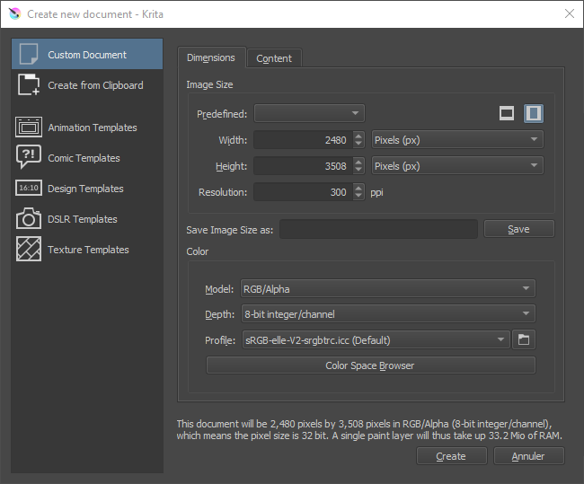
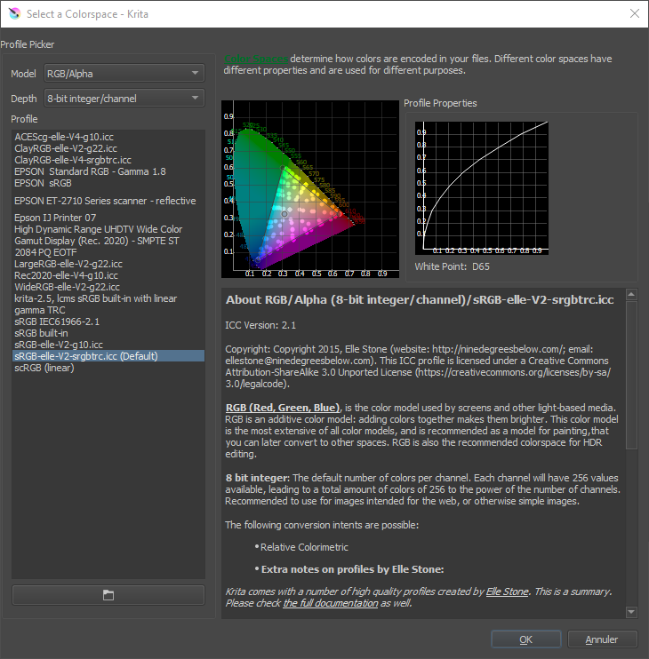
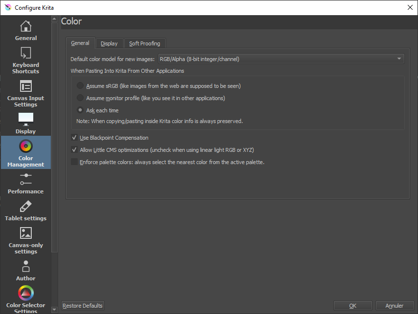
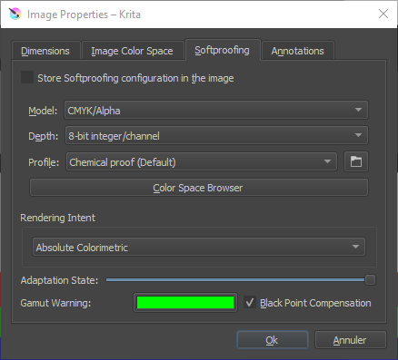
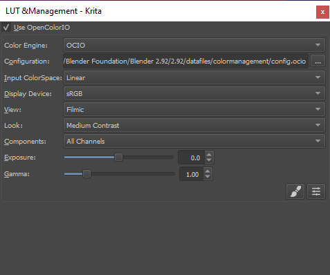

# II.L - Gestion des couleurs : Krita

*Krita* est très complet dans la gestion des couleurs, et utilise notamment *OCIO[\*](ZZ-vocabulaire.md)*.

Il a comme unique défaut le fait qu'on ne puisse pas spécifier l'espace colorimétrique des images qu'on importe individuellement. Cela peut poser un problème notamment lorsqu'on importe des fichiers *openEXR[\*](ZZ-vocabulaire.md)* qui ne viennent pas d'une application partageant la même configuration *OCIO[\*](ZZ-vocabulaire.md)* ou si l'on mélange des fichiers utilisant différent espaces colorimétriques.

La documentation de *Krita* inclue[ des explications intéressantes et détaillées sur les couleurs](https://docs.krita.org/en/general_concepts/colors.html) et la gestion des couleurs (en anglais).

## L.1 - Espace de travail

L'espace de travail se définit lors de la création d'un document *Krita*.

On peut choisir l'espace parmi la liste dans l'ongler *Color*.

- ***Model*** permet de choisir le format dans lequel les couleurs seront enregistrées dans le document. On reste en général sur *RGB/Alpha* si on travaille en vidéo, ou éventuellement *CMYK/Alpha* en cas de document destiné à l'impression.
- ***Depth*** définit la profondeur des couleurs. On choisira en général *16-bit float/channel* en travaillant pour de la vidéo ou animation.
- ***Profile*** permet de sélectionner l'espace de travail, souvent *scRGB (Linear)* ou *ACEScg* pour la vidéo.

Le bouton ***Color Space Browser*** ouvre une boîte de dialogue plus complète décrivant les différents espaces colorimétriques disponibles et facilitant le choix.

On peut aussi parcourir les fichiers pour choisir un espace au format *ICC*.

Il est possible de modifier le profil utilisé par défaut dans les nouveaux documents via les préférences de *Krita*.

On peut aussi y régler quelques autres options.

Pour changer l'espace de travail d'un document déjà ouvert, on passe par le menu *Image* puis *Propriétés*.

On y retrouve les mêmes réglages que lors de la création du document.

## L.2 - Affichage

### L.2.a - Écran

On peut spécifier l'espace colorimétrique de l'affichage pour chaque écran branché à l'ordinateur, dans les préférences de *Krita*. En général, on laisse en *sRGB* sauf dans le cas ou l'écran utiliserait un espace différent.

### L.2.b - Épreuvage (soft-proofing)

Il est possible, dans le troisième onglet des préférences, de configurer la *simulation* de l'affichage en fonction de l'espace de sortie finale, ce qui est particulièrement intéressant dans *Krita* en cas de travail pour l'impression.

La couleur sélectionnable dans ***Gamut Warning*** est celle utilisée pour afficher des alertes montrant les zones de l'image en dehors du *gamut[\*](ZZ-vocabulaire.md)* de sortie, et qui donc seront changées lors de la sortie.

Une fois l'épreuvage configuré, on peut l'activer et le désactivier pour l'affichage des documents via le menu *View* (*Affichage*) ou avec le raccourci clavier `[CTRL] + [Y]`. *Krita* peut aussi afficher une alerte sur les zones de l'image dont les couleurs sont en dehors du *gamut* de sortie, aussi via le menu *View* (*Affichage*) ou bien avec le raccourci clavier `[CTRL] + [SHIFT] + [Y]`.

On peut aussi définir ces paramètres d'épreuvage uniquement pour le document ouvert, via le menu *Image* puis *Propriétés*.

## L.3 - Sélecteur de Couleurs

*Krita* permet de régler l'espace d'affichage des sélecteurs de couleur, ce qui est bien pratique. On retrouve le réglage dans un onglet des préférences.

En général, on cochera la case permettant de choisir un espace spécifique pour le sélecteur de couleur (notamment un espace non-linéaire, comme le simple *sRGB* utilisé par les écrans).

Dans le cas d'un travail en *16* ou *32 bpc flottant* et un espace linéaire, les types de sélecteurs différents de *HSV* (teinte, saturation, valeur) - c'est à dire *HSL*, *HSI* et *HSY* - peuvent ne pas fonctionner correctement (car ils doivent avoir un blanc maximum qui n'existe plus en linéaire).

## L.4 - Sortie

Lors de l'enregistrement des fichiers, *Krita* affiche une boite de dialogue avec les options adaptées. En cas d'enregistrement au format natif `.kra` ou *openEXR[\*](ZZ-vocabulaire.md)*, c'est l'espace de travail qui est utilisé ; sinon *Krita* fera une conversion vers l'espace standard du fichier enregistré.

  
*Exemple pour une sortie PNG et sa conversion en* sRGB, *ou optionnellement en* Rec.2020.

## L.5 - OCIO dans Krita

*Krita* utilise *OCIO* qui se configure simplement via le *Docker* (panneau) appelé *LUT Management* (*Gestion des LUT*).

  
*Un exemple avec la configuration OCIO Filmic de Blender*

