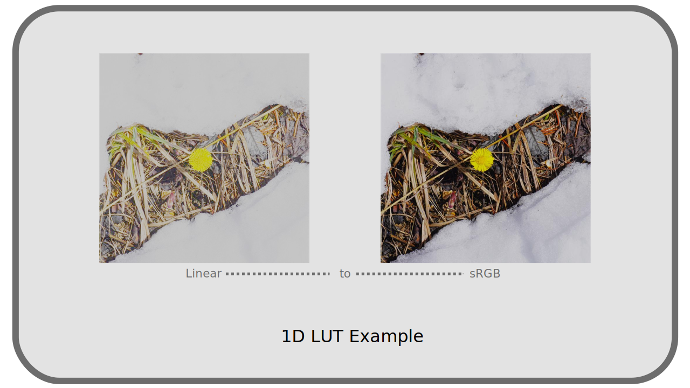

# Les LUTs

L'acronyme anglais *LUT* vient de *Lookup Table*, *Table de correspondance* en français.

[TOC]

## M.1 - Description

Comme son nom l'indique, c'est un simple tableau de valeurs, permettant de faire correspondre à certaines valeurs en entrée d'autres valeurs en sortie. En informatique, c'est un moyen pratique de remplacer des fonctions mathématiques complexes, résultat de calculs qui prennent du temps, par une simple recherche dans le tableau, ce qui peut grandement améliorer les performances : au lieu d'avoir à recalculer, on a déjà les résultats en mémoire.

On en garde l'usage en couleurs ; c'est un moyen simple de faire correspondre à une couleur en entrée une couleur différente en sortie : c'est donc un tableau qui permet de retoucher les couleurs ou bien convertir des espaces colorimétriques, en les décrivant, couleur par couleur.

Le principal intérêt d'une *LUT* est que n'importe quel programme peut facilement les utiliser et donc convertir depuis et vers des espaces colorimétriques qui ne sont pas prévus à la base par le programme ; au lieu d'avoir à "connaitre" les fonctions mathématiques qui définissent un espace de couleurs (notamment la courbe de transfert), le programme n'a qu'à lire les résultats dans la *table de correspondance* sans avoir à en effectuer le calcul. C'est un usage *utilitaire*, de conversion.

Elles sont aussi un moyen de "sauvegarder" n'importe quelle retouche colorimétrique ; même si une retouche est faite en utilisant de multiples effets dans une application (niveaux, courbes, saturation...), on peut la décrire et sauvegarder comme une seule *LUT* et ainsi réappliquer la même retouche facilement, et dans *n'importe quelle application* capable de lire une *LUT*. Dans ce cas, c'est un usage *artistique* et pratique.

Voici un exemple de quelques lignes de valeurs d'une *LUT*, qui n'est en réalité qu'un fichier texte contenant ce genre de tableau de valeurs :

| R | G | B |
|---|---|---|
|0|0|0|
|0|0|298|
|0|0|596|
|0|0|894|
|0|351|0|
|0|326|260|
|0|302|558|
|0|278|856|
|381|3784|0|
|282|3760|0|
|184|3736|117|
|85|3712|415|

Une *LUT* ne décrit donc pas *toutes* les correspondances de couleurs possibles, mais bien une sélection de couleurs ; pour obtenir une couleur qui n'est pas dans la table, il faut donc effectuer une *interpolation*. Normalement, l'application utilisant la *LUT* propose differente interpolations qui vont changer la manière dont ces couleurs sont obtenues (par arrondi, interpolation linéaire, etc.).

La quantité de valeurs contenues dans une *LUT* est donc très importante pour la qualité de l'image en sortie : n'étant qu'une table de valeurs limitées, il peut y avoir une perte lors de la conversion et le résultat peut plus ou moins différer par rapport à une vraie opération mathématique. Cela étant dit, la différence n'est pas discernable dans le cas des *LUT* avec beaucoup de valeurs, comme celles utilisées par *OCIO + ACES* pour ses conversions par exemple. *Cf.* Chapitre *[N - OCIO, ACES](N-ocio.md)*.

## M.2 - Utilisation

Il existe de nombreux formats de fichiers différents pour les *LUT*, dépendant des applications, des développpeurs, etc. Voici quelques exemples (formats supportés par *[FFmpeg](http://ffmpeg.org)*) :

| Extension | Nom, éditeur, application... |
|---|---|
|*3dl*|Discreet / After Effects / Autodesk|
|*cube*|Iridas / Resolve|
|*dat*|DaVinci|
|*m3d*|Pandora|
|*csp*|cineSpace|
|*spi1d*, *spi3d*|Sony Pictures|

Il peut être utile utile de convertir entre différents formats de *LUT* ; *[OCIO](N-ocio.md)* inclue un outil de conversion en ligne de commande, pour lequel l'encodeur de médias *[DuME](https://rainboxlab.org/tools/dume/)* propose une interface graphique.

Il y a deux types principaux de *LUT* : les ***LUT 1D*** et les ***LUT 3D***.

- **LUT 1D**

Les *LUT 1D* ne travaillent que sur la *luminance* et ne modifient pas les couleurs. N'ayant qu'une dimension, elles sont plus légères et plus simples que les *LUT 3D* et sont utiles pour les conversions de *gamma[\*](ZZ-vocabulaire.md)*, par exemple entre deux espaces colorimétriques qui auraient par ailleurs les mêmes *primaires[\*](ZZ-vocabulaire.md)*. *Cf.* chapitre *[L - Courbes de transfert, espace linéaire et gamma](L-transfert.md)*.

- **LUT 3D**

Les *LUT 3D* travaillent sur les trois couches rouge, verte et bleue. Elles permettent donc une retouche détaillée à la fois de la luminance et des teintes autant que de la saturation. Elle permettent des effets artistiques aussi bien que des conversions depuis et vers n'importe quel espace colorimétrique.

Quel que soit le type de *LUT*, ces tables de conversions n'offrant qu'une simple correspondance de valeur, **chaque _LUT_ est conçue pour un espace et des couleurs précises en entrée** et **ne peut pas être utilisée indifféremment sur n'importe quelle image** !

Par exemple, une *LUT* qui convertit vers l'espace colorimétrique *Rec.2020* est **forcément** prévue pour être appliquée sur une image d'un autre espace colorimétrique précis, par exemple *Rec.709* ; dans cet exemple, elle **ne peut pas** être utilisée sur une image *sRGB*, à moins de l'avoir préalablement convertie vers *Rec.709*.

C'est valable aussi pour les *LUT* à usage artistique et non pas utilitaire. Il faut savoir sur quel espace et quel type d'image chaque *LUT* est censée être appliquée. Suivant les applications, le choix de l'espace de travail est donc important en cas d'usage de *LUT*, ou en tout cas il faut en avoir conscience pour éventuellement effectuer des conversions préalables à l'usage de *LUT* (ce qui fait qu'elles ne sont pas si simples qu'elles en ont l'air).

----
Sources et références

- [Table de correspondance sur *Wikipedia*](https://fr.wikipedia.org/wiki/Table_de_correspondance)
- [1D vs 3D LUTs by James Ritson on *Affinity Spotlight* (en anglais)](https://affinityspotlight.com/article/1d-vs-3d-luts/)[^1]

[^1]:
    Attention, sa conclusion comporte une erreur. Dans l'article, James Ritson explique qu'une *LUT 1D* peut être utilisée pour convertir une image de *Rec.2020* à *Rec.709*, ce qui est faux puisque les *primaires[\*](ZZ-vocabulaire.md)* des deux espaces sont différentes, et non pas juste la *courbe de transfert[\*](ZZ-vocabulaire.md)*. Il faut alors utiliser une *LUT 3D*. Par contre la conversion de *Rec.709* à *sRGB* est bien possible avec une *LUT 1D* puisque seule la *courbe de transfert* est différente.

