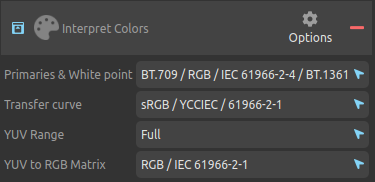
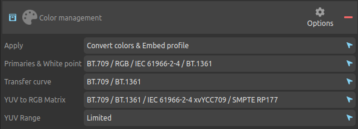

# II.M - Gestion des couleurs : Duduf Media Encoder (DuME)

[*DuME*](https://rainboxlab.org/tools/dume/) est un encodeur/convertisseur de médias libre et gratuit, basé sur [*ffmpeg*](http://ffmpeg.org) et [OpenColorIO](http://opencolorio.org).

## M.1 - Espace de travail

En général, pour encoder des médias, on n'a pas nécessairement besoin de définir un espace de travail, mais *DuME* permettant aussi de modifier les vidéos, il peut être utile d'y choisir un espace de travail spécifique ; c'est aussi utile pour encoder directement des fichiers *openEXR* depuis un rendu dans le même espace que celui du rendu.

L'espace se sélectionne simplement dans le panneau de sortie.

## M.2 - Entrée

L'interprétation des couleurs en entrée se fait en ajoutant le bloc *Interpret Colors* dans le panneau de l'entrée.

!!! hint
    En l'absence du bloc *Interpret Colors*, *DuME* utilise ses propres règles pour "deviner" l'espace à utiliser, en respectant les standards les plus courants, ce qui rend ce bloc optionnel si les fichiers en entrée sont standards.

On peut régler individuellement les caractéristiques de l'espace colorimétrique du fichier en entrée.

- ***Primaries & White point*** : primaires[\*](ZZ-vocabulaire) et point blanc (*illuminant[\*](ZZ-vocabulaire)*) à utiliser, définis par le nom de l'espace ou de la norme correspondante.
- ***Transfer curve*** : courbe de transfert[\*](ZZ-vocabulaire) à utiliser, définie par le nom de l'espace ou de la norme correspondante.
- ***YUV Ranve*** : permet de choisir entre *Full* et *Limited* en fonction du fichier.
- ***YUV to RGB Matrix*** : définit la méthode mathématique utilisée pour les conversions entre *YUV* et *RGB*.

En cas de doute, il est toujours possible de laisser un des paramètres sur "*Auto*".

!!! tip
    DuME propose une liste de pré-réglages pour tous les espaces les plus courants, voir ci-dessous.

## M.3 - Sortie

De même que pour l'entrée, les réglages de sortie se font via un bloc *Color management* dans le panneau de sortie.

Les paramètres sont les mêmes que pour l'entrée.

!!! hint
    Comme pour l'entrée, en l'absence du bloc *Color management*, *DuME* utilise ses propres règles pour "deviner" l'espace à utiliser, en respectant les standards les plus courants, ce qui rend ce bloc optionnel si les fichiers en entrée sont standards.

!!! tip
    DuME propose une liste de pré-réglages pour tous les espaces les plus courants, voir ci-dessous.

## M.4 - Pré-réglages

Pour sélectionner plus rapidement et sans erreur les différents paramètres d'entrée et de sortie, *DuME* propose plusieurs pré-réglages, accessibles en cliquant sur le bouton des options du bloc.

On y retrouve les espaces les plus courants, y compris *ACES* dans les dernières versions.

## M.5 - LUT

Il est aussi possible d'appliquer une *LUT[\*](ZZ-vocabulaire.md)* lors de l'encodage des médias, via le bloc *Apply LUT* dans le panneau de sortie.

*DuME* propose plusieurs *LUT*, notamment celle permettant de convertir depuis ou vers *ACES* ou *Blender Filmic*, et on peut y charger d'autres fichiers de *LUT*.

*DuME* propose aussi dans ses outils un outil de conversion de *LUT*, qui permet de convertir entre de nombreux formats.

## M.6 - OCIO

Il n'y a pas de support direct de *OCIO[\*](ZZ-vocabulaire.md)* lors de l'encodage des médias, mais *DuME* propose un outil de génération de *LUT* depuis une config *OCIO*, qui peuvent alors être utilisées lors de l'encodage (voir ci-dessus).

Les différents paramètres se retrouvent en lisant le fichier de config *OCIO*, *cf*. section *[II.F - Concevoir une chaîne de fabrication avec OCIO](ocio.md)*